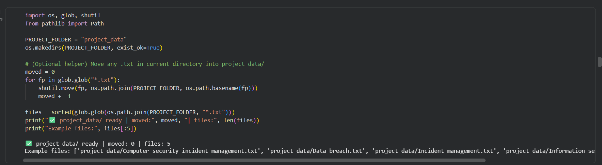
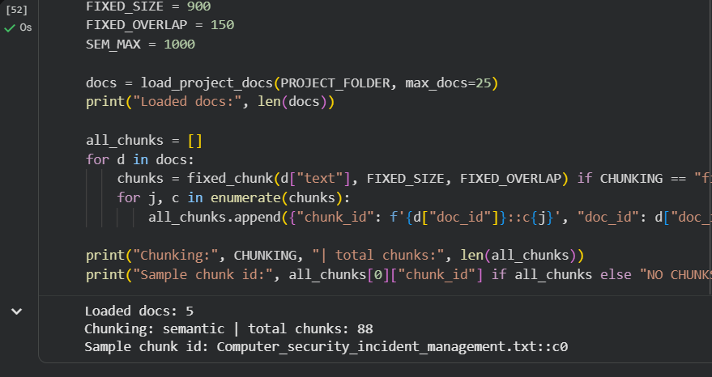
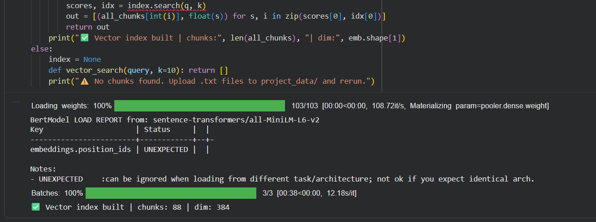
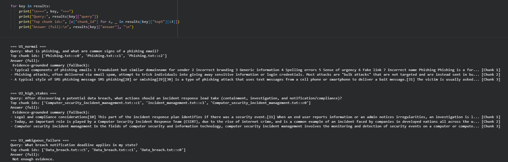
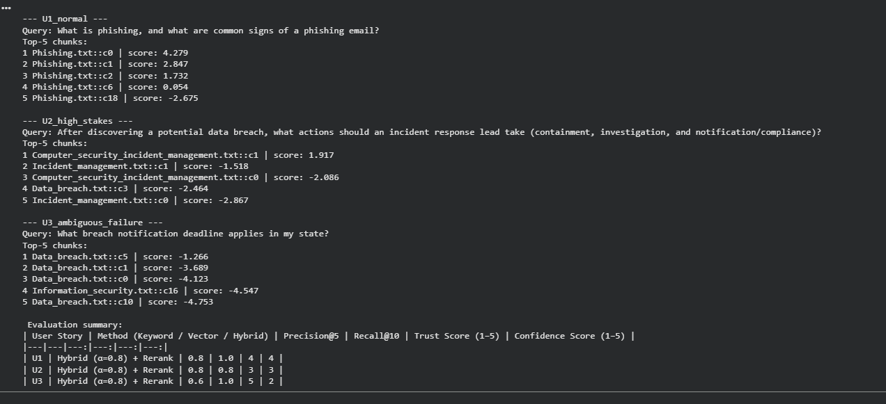

# CS 5588 — Week 2 Hands-On
## Applied RAG for Product & Venture Development

> **Course:** CS 5588 — Data Science Capstone / GenAI Product Leadership  
> **Student:** Salman Mirza  
> **Project / Product Name:** SecOps RAG Assistant — Incident Response Copilot  
> **GitHub:** https://github.com/SalmanM1/CS5588
> **Date:** Jan 29, 2026  

---

## 1. Product Overview

### Problem Statement
During security incidents, responders waste time searching scattered guidance and may take the wrong steps under pressure. In high-stakes situations like phishing and potential data breaches, incorrect or overconfident answers can increase harm and create compliance risk. This product focuses on delivering fast, evidence-backed guidance instead of “confident guessing.”

### Target Users
SOC analysts, junior security engineers, and IT responders who need quick, consistent answers during phishing incidents, suspected breaches, and post-incident review.

### Value Proposition
This system provides **grounded answers with citations** pulled from an approved knowledge base (incident management + incident response concepts). Compared to a generic chatbot or manual searching, it reduces hallucinations, supports auditability, and can safely abstain when evidence is missing.

---

## 2. Dataset Reality

### Data Source & Ownership
- **Source:** Public Wikipedia pages converted to `.txt` for this prototype  
- **Owner (public / company / agency / internal):** Public (prototype); in production this would be owned by the organization’s Security/GRC and IT teams

### Sensitivity & Ethics
- **Sensitivity level (public / internal / regulated / confidential):** Public (prototype); production would be **internal/confidential**
- **Privacy / compliance concerns:** Real incident docs can contain sensitive data (PII, credentials, IPs, tooling details). A real deployment requires access control, redaction/de-identification, retention rules, and audit logging.

### Document Types
Security fundamentals reference docs, incident management/incident response guidance, breach definitions, phishing descriptions, and process overviews.

### Expected Scale in Production
- Prototype: 5 docs  
- Production: ~200–2,000 docs (IR playbooks, runbooks, policies, SOPs, de-identified tickets, post-incident summaries)

**Prototype documents used (5):**
- `Incident_management.txt`
- `Computer_security_incident_management.txt`
- `Data_breach.txt`
- `Phishing.txt`
- `Information_security.txt`

---

## 3. User Stories & Risk Awareness

### U1 — Normal Use Case
> As a SOC analyst, I want a quick definition of phishing and what to look for in a suspicious email so that I can triage alerts faster and avoid clicking risky links.

**Acceptable Evidence:**
- `Phishing.txt` (definition + common indicators)

**Correct Answer Criteria:**
- Define phishing as social engineering to trick users into revealing sensitive info and/or installing malware  
- List multiple phishing indicators (urgent tone, fake links, spoofed domains, generic greeting, spelling/branding errors)

---

### U2 — High-Stakes Case
> As an incident response lead, I want guidance on what actions to take after discovering a potential data breach so that I can contain impact, investigate scope, and meet notification/legal obligations.

**Why This Is High Risk:**
Breach response can affect customers, business continuity, and legal compliance. Wrong guidance can delay containment and increase legal exposure.

**Acceptable Evidence:**
- `Data_breach.txt` (breach definition + response/notification context)  
- `Computer_security_incident_management.txt` (incident response planning + legal/compliance implications)  
- `Incident_management.txt` (restoring operations / minimizing business impact context)

**Correct Answer Criteria:**
- Define what a data breach is (unauthorized exposure/disclosure/access involving personal information)  
- Include actions aligned to containment + investigation + notification/compliance considerations  
- Acknowledge legal/compliance involvement and escalation beyond purely technical steps

---

### U3 — Ambiguous / Failure Case
> As a compliance-minded responder, I want to know exactly what breach notification deadline applies in my state so that I can file notifications correctly and avoid penalties.

**What Could Go Wrong:**
The system might invent a deadline that isn’t in the dataset, causing compliance violations.

**Safeguard Needed:**
Abstain with **“Not enough evidence”** and cite evidence showing the dataset does not include state-specific deadlines; recommend consulting official legal sources or internal counsel.

---

## 4. System Architecture (Product View)

### Chunking Strategy
- **Fixed or Semantic:** Semantic (paragraph-based packing)
- **Chunk size / overlap:** ~1000 chars max per chunk (semantic packing)
- **Why this fits your product users:** Security guidance is context-heavy. Semantic chunking improves citation quality and reduces misleading “half-context” retrieval.

### Retrieval Design
- **Keyword layer (TF-IDF / BM25):** BM25 keyword search
- **Vector layer (embedding model + index):** `sentence-transformers/all-MiniLM-L6-v2` + FAISS (cosine via normalized inner product)
- **Hybrid α value(s):** α = 0.8 (precision-first for compliance/security terms)

### Governance Layer
- **Re-ranking method (Cross-Encoder / LLM Judge / None):** Cross-Encoder reranker (`cross-encoder/ms-marco-MiniLM-L-6-v2`)
- **What risk this layer reduces:** Reduces “topic-related but not directly relevant” evidence, lowering hallucination risk and improving trust in citations.

### Generation Layer
- **Model used:** `google/flan-t5-base` (seq2seq)
- **Grounding & citation strategy:** Answer must use only retrieved evidence and include citations like `[Chunk 1]`, `[Chunk 2]`, `[Chunk 3]`
- **Abstention policy (“Not enough evidence” behavior):** If evidence cannot support the answer (e.g., state-specific deadlines), respond with **“Not enough evidence.”**

---

## 5. Results

| User Story | Method (Keyword / Vector / Hybrid) | Precision@5 | Recall@10 | Trust Score (1–5) | Confidence Score (1–5) |
|---|---|---:|---:|---:|---:|
| U1 | Hybrid (α=0.8) + Rerank | 0.8 | 1.0 | 4 | 4 |
| U2 | Hybrid (α=0.8) + Rerank | 0.8 | 0.8 | 3 | 3 |
| U3 | Hybrid (α=0.8) + Rerank | 0.6 | 1.0 | 5 | 2 |

---

## 6. Failure Case & Venture Fix

### Observed Failure
For the high-stakes breach-response case (U2), the system retrieved relevant evidence but the generated answer was not always consistently formatted as clear, actionable steps with proper citations (sometimes producing weak structure or citation issues).

### Real-World Consequence
In a real incident, unclear or poorly grounded guidance can delay containment and escalation, increase downtime, and raise compliance risk if responders miss required notification/legal steps. Even if the evidence exists, low-quality output reduces trust and can lead to wrong actions under pressure.

### Proposed System-Level Fix
- **Data:** Add a real internal IR playbook/runbook with explicit containment/investigation/notification steps  
- **Chunking:** Ensure operational steps remain grouped (semantic chunking with careful max size)  
- **Hybrid α:** Keep α precision-leaning for compliance terms; tune per query class if needed  
- **Re-ranking:** Keep cross-encoder; add thresholds so weak evidence triggers abstention  
- **Human-in-the-loop review:** For breach/legal questions, route to human review or require confirmation from official policy/legal sources

---

## 7. Evidence of Grounding

Below is an example of a **RAG-grounded output** from the pipeline. The answer is based only on retrieved evidence and includes citations to the exact chunks used.

> **Query:** What is phishing, and what are common signs of a phishing email?
>
> **Answer (RAG-grounded):**  
> **Evidence-grounded summary (fallback):**
> - Phishing is a social engineering scam where attackers try to deceive people into revealing sensitive information and/or installing malware. **Common signs** include look-alike sender domains, incorrect branding, generic wording, spelling errors, urgency, fake links, and incorrect names. [Chunk 1]  
> - Phishing attacks are often delivered via email spam and attempt to trick users into giving away sensitive information or login credentials, commonly at scale (“bulk attacks”). [Chunk 2]  
> - Phishing can also happen over SMS (“smishing”), where bait text messages try to get the victim to click a link or provide information. [Chunk 3]
>
> **Citations:** [Chunk 1], [Chunk 2], [Chunk 3]

---

## 8. Reflection (3–5 Sentences)
This lab showed me that building a trustworthy product is more than making a model generate text—it requires designing the system so answers are grounded in evidence and safe under uncertainty. Retrieval quality and chunking directly influence whether citations actually support the response. Governance layers like reranking reduce risk by improving evidence selection, not just accuracy metrics. Finally, abstention is critical in high-stakes settings because the most harmful failures come from confident guesses when the dataset doesn’t contain the needed information.

---

## Screenshots (Lab Evidence)

### Dataset Loaded

### Chunking

### Model Loading / Setup

### RAG Query Outputs (U1/U2/U3)

### Evaluation Metrics

## Reproducibility Checklist
- [x] Project dataset included or linked
- [x] Notebook runs end-to-end
- [x] User stories + rubric completed
- [x] Results table filled
- [x] Screenshots or logs included

---

> *CS 5588 — UMKC School of Science & Engineering*  
> *“We are not building models. We are building products people can trust.”*